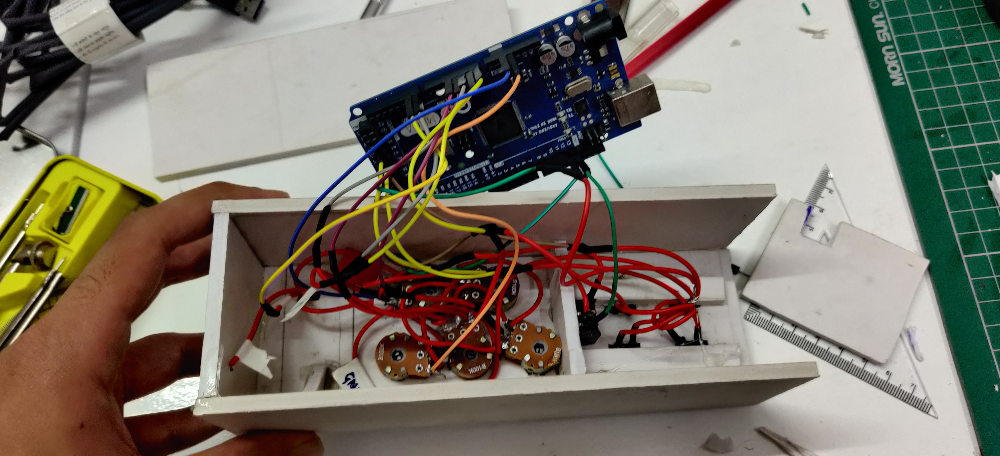

# MIDI Controller

A hand-built MIDI controller: five knobs, four keys, a joystick and a couple of toggle switches in a foam-board case, driven by an Arduino. Plug it in over USB and it shows up as a MIDI device in any DAW, so you can play notes, turn knobs and bend pitch on real hardware instead of clicking around a screen.


## What it does

- **Five knobs** send MIDI Control Change messages, so each one can be mapped to a filter cutoff, a send level, a synth parameter or anything else your DAW lets you MIDI-learn.
- **Four keys** play notes. They start on middle C and two transpose switches move the whole keypad an octave up or down, across the full MIDI note range.
- **A joystick** doubles as a modulation wheel on one axis and a pitch bend wheel on the other, with a toggle switch under each axis so you can lock one off while you play.
- **Jitter filtering** on every analog input keeps the serial link quiet. Only real movement produces a message, so the DAW never gets flooded.

It runs in FL Studio here, but anything that accepts a MIDI input works the same way.


## How it works

The Arduino reads every control in a loop and, whenever one changes enough to matter, writes a three-byte MIDI message over its serial port. On the computer, [Hairless MIDI](https://projectgus.github.io/hairless-midiserial/) turns that serial stream into MIDI and [loopMIDI](https://www.tobias-erichsen.de/software/loopmidi.html) exposes it as a virtual MIDI port that the DAW can pick up.

```
knobs / keys / joystick  →  Arduino  →  USB serial  →  Hairless MIDI  →  loopMIDI port  →  DAW
```

Every message follows the standard MIDI layout: a status byte that says what kind of message it is and which channel it is on, then two data bytes.

| Control | Message | Status byte | Data 1 | Data 2 |
| --- | --- | --- | --- | --- |
| Knobs 1 to 5 | Control Change, channel 2 | `177` | controller number `0` to `4` | value `0` to `127` |
| Key pressed | Note On, channel 1 | `144` | note number | velocity `127` |
| Key released | Note Off, channel 1 | `128` | note number | velocity `0` |
| Joystick X | Control Change 1 (mod wheel), channel 1 | `176` | `1` | value `127` to `0` |
| Joystick Y | Pitch Bend, channel 1 | `224` | low 7 bits | high 7 bits |

## The build

The case is cut from foam board. The knobs sit in a row of five and share a common supply rail, soldered as a daisy chain so only one pair of wires has to run back to the board for power and ground. Each wiper goes to its own analog pin.


The keys are tactile switches set into a 2×2 grid cut out of the panel.


Everything terminates on an Arduino Mega sitting in the back of the case.



### Parts

- Arduino Mega (any board with enough analog inputs and a USB serial port will do)
- 5 × B100K potentiometers
- 4 × tactile switches, wired as a keypad
- 1 × two-axis analog joystick module
- 2 × toggle switches for transpose, 2 × toggle switches for the joystick axes
- 1 × LED for power
- Foam board, jumper wire, hot glue

## The code

The sketch is split into four tabs, one per concern. They share a handful of globals (pin numbers, last-read values, the transpose offset and the `Keypad` object) that live in the main tab alongside `setup()`, which opens the serial port, and `loop()`, which calls the three readers in turn.

### `readPots.ino`

Reads the five potentiometers and compares each reading against the last one it sent. If the difference is bigger than a small threshold (`4` out of `1023`) it maps the reading to `0` to `127` and sends a Control Change on channel 2, with controller numbers `0` to `4` for the five knobs. The threshold is what stops a cheap pot that is hovering between two adjacent values from spamming the DAW.

### `readKeyPad.ino`

Uses the [Keypad library](https://www.arduino.cc/reference/en/libraries/keypad/) to scan the keys, and only reacts to keys whose state has changed. A press sends Note On with velocity `127`, a release sends Note Off with velocity `0`. Key 1 is middle C (note `60`) and the other keys step up one semitone each.

Two toggle switches handle transpose. Flipping one shifts the whole keypad by twelve semitones, with a one-second debounce so a held switch only fires once, and limits so the notes stay inside `0` to `127`.

### `readJoystick.ino`

The joystick is two potentiometers with a limited travel, so each axis gets its own toggle switch and its own threshold (`2`).

- The X axis sends Control Change 1, the standard modulation wheel, mapped so that pushing right lowers the value.
- The Y axis sends Pitch Bend, which is a 14-bit value. The reading is mapped to `-8000` to `8000` around the centre (`0x2000`, no bend), then split into a low and a high 7-bit byte before sending.

### `MIDImessage.ino`

A three-line helper that writes the status byte and two data bytes to `Serial`. Every other tab calls it. The [MIDI status byte table](https://www.midi.org/specifications-old/item/table-2-expanded-messages-list-status-bytes) is the reference for what each byte means.

## Getting it onto your computer

1. Upload the sketch to the Arduino and connect it over USB.
2. Install **loopMIDI** and create a virtual port.
3. Install **Hairless MIDI**, pick the Arduino's serial port on the left and the loopMIDI port on the right, and match the baud rate to the one the sketch opens. The debug pane shows every message as it arrives, which makes wiring mistakes easy to spot.


4. In your DAW, enable the loopMIDI port as a MIDI input. The keys play straight away; the knobs and joystick can be MIDI-learned onto whatever you like.


## Repository

```
MIDImessage.ino    serial MIDI helper
readPots.ino       five knobs → Control Change
readKeyPad.ino     keys + transpose switches → Note On / Note Off
readJoystick.ino   joystick → mod wheel + pitch bend
images/            build photos
```
